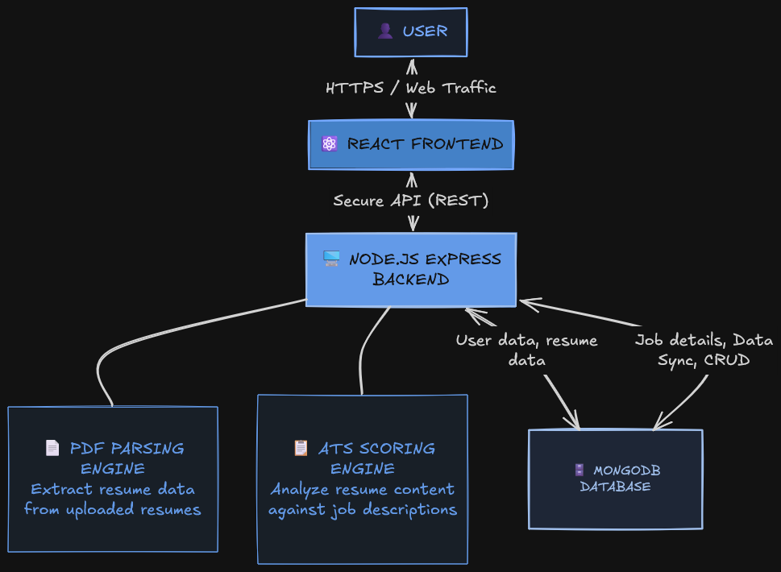
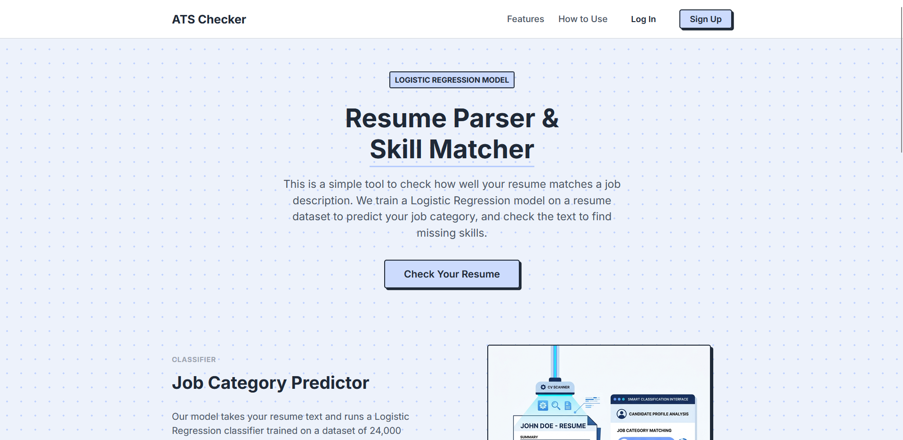
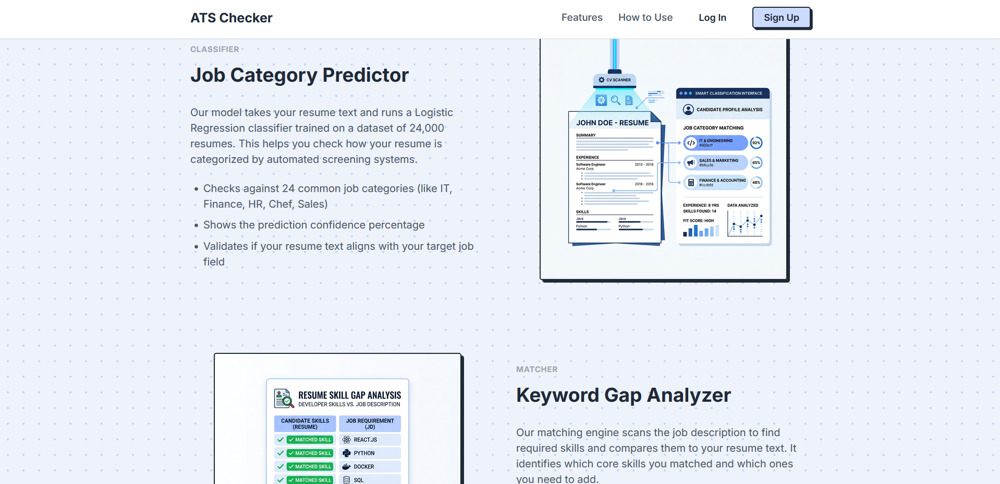
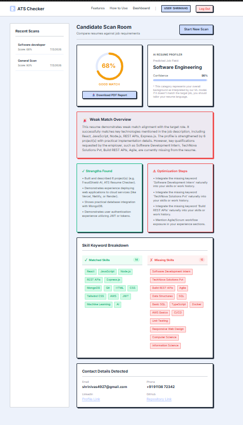
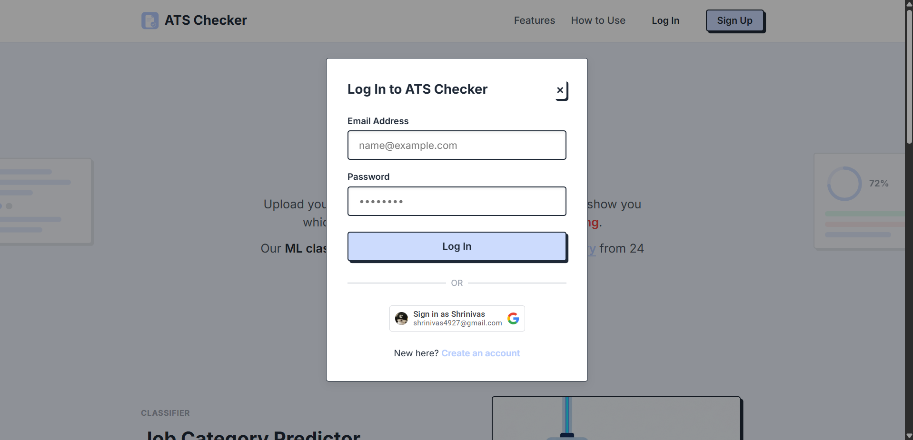
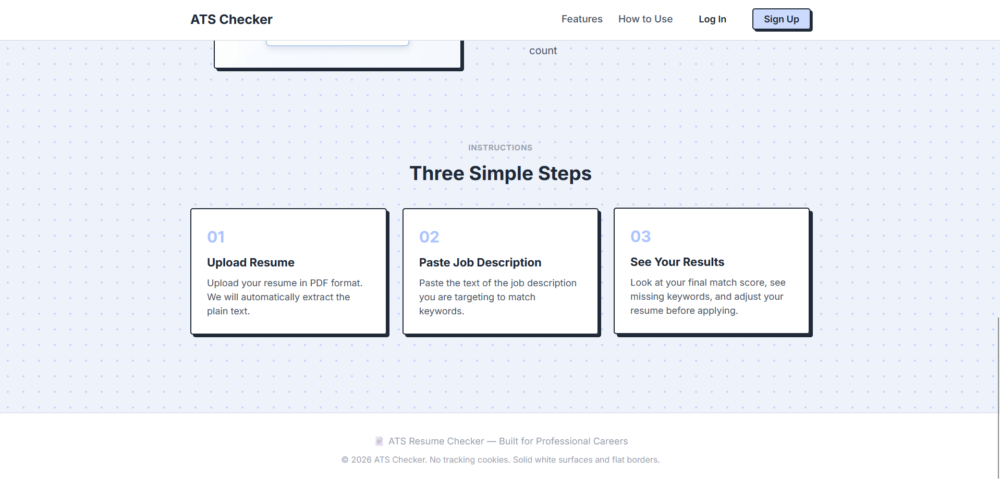

# ATS Resume Analyzer

[](https://opensource.org/licenses/MIT)
[](https://nodejs.org/)
[](https://reactjs.org/)
[](https://www.mongodb.com/)

## Overview
ATS Resume Analyzer is a full-stack web application designed to help job seekers optimize their resumes for Applicant Tracking Systems (ATS). By analyzing a resume PDF against a target job description, the system provides a comprehensive match score based on technical skills, experience, education, and formatting. This tool demystifies the screening process, enabling users to tailor their applications effectively.

## Features
- **Automated Resume Parsing**: Seamlessly extracts text from uploaded PDF resumes.
- **Intelligent Keyword Matching**: Compares extracted resume text against job descriptions to identify missing and matched core skills.
- **Weighted Scoring System**: Calculates an overall match percentage factoring in skills, experience, and educational requirements.
- **Detailed Analytics Dashboard**: Visualizes missing skills and formatting errors in an intuitive, responsive UI.
- **User Authentication**: Secure local authentication and Google OAuth 2.0 integration for seamless login.
- **Scan History**: Allows authenticated users to save, track, and review past resume analyses.
- **PDF Report Generation**: Export analysis results as downloadable PDF reports.

## Tech Stack
- **Frontend**: React 19, Vite, React Router, Radix UI, Framer Motion, jsPDF
- **Backend**: Node.js, Express.js, Multer (file handling), pdf-parse, Zod (validation)
- **Database**: MongoDB (Atlas), Mongoose ODM
- **Authentication**: JWT (JSON Web Tokens), Google OAuth 2.0, bcryptjs
- **Testing**: Jest, Supertest (Backend) | Vitest, Playwright (Frontend)
- **Deployment**: Vercel (Frontend), Render (Backend)
- **Tools**: ESLint, npm workspaces (Monorepo setup)

## Architecture


**User** → **Frontend (React)** → **REST API (Express)** → **Backend Logic (PDF parsing & text matching)** → **Database (MongoDB)**

1. The user uploads a PDF and pastes a Job Description on the React frontend.
2. The frontend sends a `multipart/form-data` request to the Express API.
3. The backend uses `pdf-parse` to extract text from the PDF.
4. The scoring engine calculates keyword matches and structural integrity.
5. The analysis result is stored in MongoDB.
6. The backend returns the calculated score and feedback to the frontend, which renders the results.

## Folder Structure
```text
ats-resume-checker/
├── backend/                  # Node.js Express server
│   ├── tests/                # Unit and integration tests (Jest)
│   ├── index.js              # Entry point & API routes
│   ├── ats_checker.js        # Core resume parsing and scoring logic
│   └── models.js             # Mongoose schemas
├── frontend/                 # React frontend application
│   ├── src/                  # React components, pages, and context
│   ├── tests/                # E2E and component tests (Playwright, Vitest)
│   └── vite.config.js        # Vite bundler configuration
├── package.json              # Monorepo configuration
└── render.yaml               # Infrastructure-as-code for Render deployment
```

## Installation

### Prerequisites
- [Node.js](https://nodejs.org/en/download/) (v18 or higher)
- [MongoDB](https://www.mongodb.com/try/download/community) (Local instance or Atlas URI)
- Google Cloud Console Project (for OAuth Client ID)

### Local Setup
1. **Clone the repository**
   ```bash
   git clone https://github.com/yourusername/ats-resume-checker.git
   cd ats-resume-checker
   ```

2. **Install dependencies**
   ```bash
   npm run install:all
   ```

3. **Configure Environment Variables**
   Set up the `.env` files as described in the [Environment Variables](#environment-variables) section.

4. **Start the development servers**
   ```bash
   npm run dev:backend & npm run dev:frontend
   ```
   The frontend will be available at `http://localhost:5173` and the backend at `http://localhost:5000`.

## Environment Variables

Create `.env` files in both the `backend` and `frontend` directories using the provided templates.

**`backend/.env`**
```env
NODE_ENV=development
PORT=<YOUR_BACKEND_PORT>
MONGODB_URI=<YOUR_MONGODB_CONNECTION_STRING>
JWT_ACCESS_SECRET=<YOUR_JWT_ACCESS_SECRET>
JWT_REFRESH_SECRET=<YOUR_JWT_REFRESH_SECRET>
JWT_ACCESS_EXPIRES_IN=15m
JWT_REFRESH_EXPIRES_IN=7d
FRONTEND_URL=<YOUR_FRONTEND_URL>
GOOGLE_CLIENT_ID=<YOUR_GOOGLE_CLIENT_ID>
```

**`frontend/.env.local`**
```env
VITE_API_URL=<YOUR_BACKEND_API_URL>
VITE_GOOGLE_CLIENT_ID=<YOUR_GOOGLE_CLIENT_ID>
```

## Usage
1. Navigate to the web application.
2. Sign up or log in using your Google account or email.
3. On the dashboard, upload your resume (PDF) and paste the target Job Description.
4. Click **Analyze**.
5. Review your match score, missing skills, and formatting recommendations.
6. Check the **History** tab to revisit past analyses.

## Screenshots

| Landing Page | Features Overview |
|-----------|--------------|
|  |  |

| Dashboard (Upload) | Detailed Results |
|-------------------|------------------|
|  |  |

| How it Works | Login Modal |
|----------------|--------------|
|  |  |

## Future Improvements
- **LLM Integration**: Implement OpenAI or Anthropic APIs for deeper semantic matching beyond keyword extraction.
- **Dockerization**: Containerize both the frontend and backend using Docker and Docker Compose for easier local development.
- **CI/CD Pipeline**: Add GitHub Actions to automatically run test suites and linting on pull requests.

## Learning Outcomes
Building this project involved solving several key software engineering challenges:
- **Binary Data Handling**: Managing file uploads (`multipart/form-data`) and parsing raw binary PDF data in Node.js.
- **Authentication Security**: Implementing secure token-based authentication (JWT) alongside third-party OAuth 2.0.
- **Monorepo Management**: Structuring a full-stack codebase efficiently using npm workspaces.
- **Algorithmic Thinking**: Designing a weighted scoring algorithm to accurately evaluate unstructured text data.

## License
This project is licensed under the MIT License - see the [LICENSE](LICENSE) file for details.
